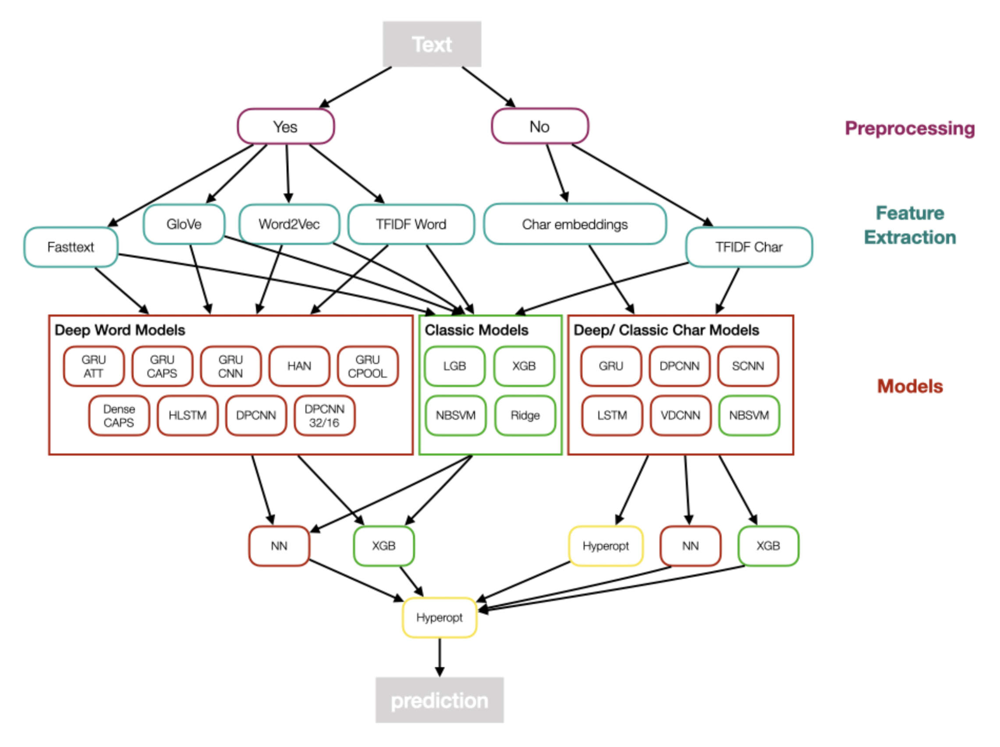
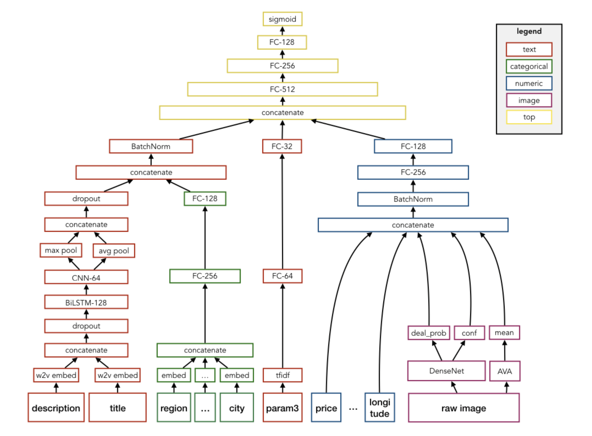
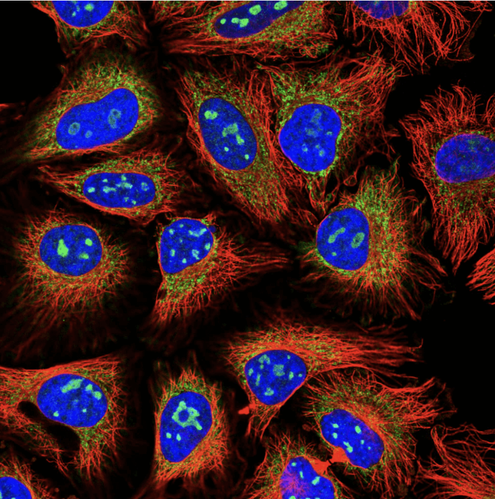
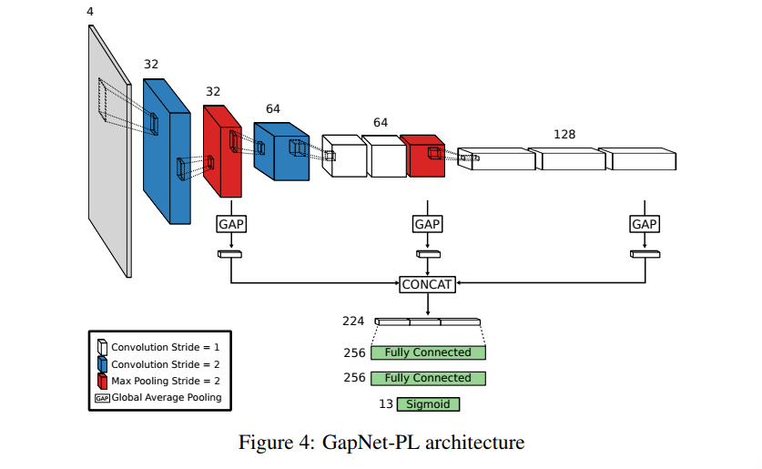
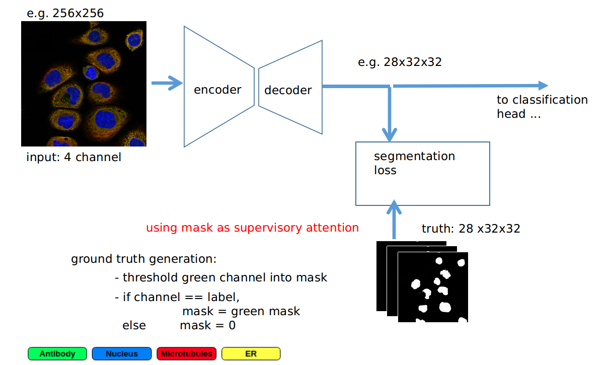

## The first silver medals

Right after my very first competition, I followed-up with the [Jigsaw Toxic Comment Classification Challenge](https://www.kaggle.com/competitions/jigsaw-toxic-comment-classification-challenge), a NLP competition with many participants. I learned from my previous mistakes, improved my code base and read kernels as well as discussions intensively. I joined forces with some other new kagglers, who I found via the discussion forum and we built a diverse and complex multi-level ensemble with many models involved. The next figure gives a rough overview.

As this competition was pre-transformer we mixed all kinds of word/ character embedding models together with classic text models like TFIDF + NaiveBayesSVM. We then stacked for 2 levels using a neural network/  gradient boosting or hyperopt of simple average weights. At the end we had more than 50 models for the team. I believe nowadays a simple bert-base would beat the whole ensemble.  

The hard team work paid off and we were rewarded with my first silver medal, by finishing 53 place out of 4539 teams. 

The remaining year was characterized by steady progress in terms of algorithmic knowledge but also code quality. Both nourished by explicitly choosing diverse competition tasks such as image classification, image segmentation, time series prediction or product demand prediction. I tried to choose diversely to have maximum learning experience, yet focused on competitions where deep learning was the way to go. Persistence and hard work resulted in two more silver medals in that year.

Highlight thereby was the [Avito Demand Prediction Challenge](https://www.kaggle.com/c/avito-demand-prediction), where competitors were asked to predict the demand of millions of products given their text and image information, with the interesting tweak that all text information is in russian language. It was quite exciting to learn how to build a combined neural network simultaneously processing image and text data, which illustrated the high degree of flexibility of deep learning. I was quite proud designing my first multi-input end2end architecture, which simultaneously takes image, text and features into account to predict a product demand score. 

Our team finished 25th place, and you can find our write-up [here](https://www.kaggle.com/competitions/avito-demand-prediction/discussion/59902).
With deep learning on the rise, all top solutions used an end2end neural network design. I am still coming back to read the details of those solutions, whenever there is a similar competition. 

During the year I also assembled my first multi-GPU desktop containing 2x GeForce 1070Ti, where it came handy that I had quite some experience in assembling PCs due to a part-time job I did in parallel to my school back in the days.
I also saw some nice synergy effects with my daily job, where I could apply some of my Kaggle knowhow to projects, encouraging my path. 

## The first gold medal 

2019 started with a very challenging and hence exciting competition: Human Protein Atlas Image Classification, where Kagglers were challenged to classify subcellular protein patterns in human cells. Not only data properties like the multi-class prediction with high class imbalance, lots of near duplicate images and external available data, but also the strong scientific domain working with four-channel immunofluorescence images made the competition quite exciting. Although the channels are separate gray images in their raw form, as soon as you combine them it creates a beautiful luminous and mesmerizing rgby image. 

{width=50%}

Now, the competition task was to classify the proteins, which have been marked by the green color. 

Having gained a reputation as a vivid and hard working beginner, I was very lucky to be offered to join a team with experienced Kagglers, including some grandmasters. For my part, since I already had a good code base from previous computer vision competitions I could focus on solving the actual problem. I read a lot of cell-imaging related papers during the competition and after that I was able to contribute two model architectures which tackled especially the issue of varying scale in the cell images. 

The first architecture is called GAPNet (short for Global Average Pooling Network) which is an underrated CNN architecture explicitly suited for scale invariance. The main idea is not to pool only the output of the last CNN block for the head of fully connected layers, but to pool the output of each CNN block and concatenate the results for an input to the fully connected layers. An illustration is shown below 

The second architecture was a standard ResNet but with an auxiliary segmentation loss. Additionally to the "normal" classification loss I used the output of the last 32x32x128 layer within ResNet34 did Conv2D to 32x32x28 and then used a downsampling of the green channel with the according labels as ground truth mask to have a segmentation loss. This segmentation loss works like a regularizer which ensures attention on the relevant regions. The additional supervised attention added quite some benefit to regularization, and the computational cost was bearable. See below for illustration

You can find the write-up of my part of the solution [here](https://www.kaggle.com/competitions/human-protein-atlas-image-classification/discussion/77300) 

Using a big ensemble of state-of the art backbones and iterative pseudo-labeling our team achieved a fantastic 4th place resulting in the first gold medal of my Kaggle career. The icing on the cake was the possibility to co-author a competition related paper which was published in nature methods [https://www.nature.com/articles/s41592-019-0658-6](https://www.nature.com/articles/s41592-019-0658-6) . Overall it was an extremely valuable experience, especially learning from [Russ Wolfinger](https://www.kaggle.com/sasrdw), a well respected Kaggle grandmaster. Also the engagement of the HPA team (which hosted the competition) with answering all kinds of domain related questions was extraordinary, making it one of my favorite competitions. 

