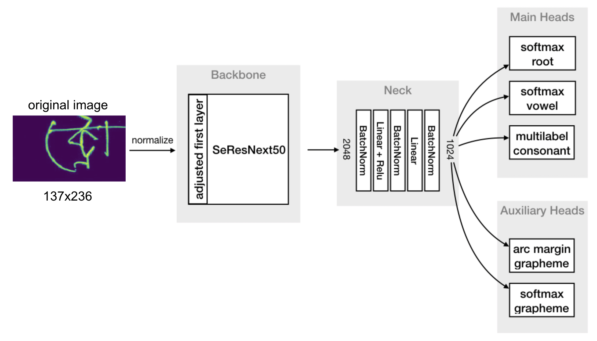
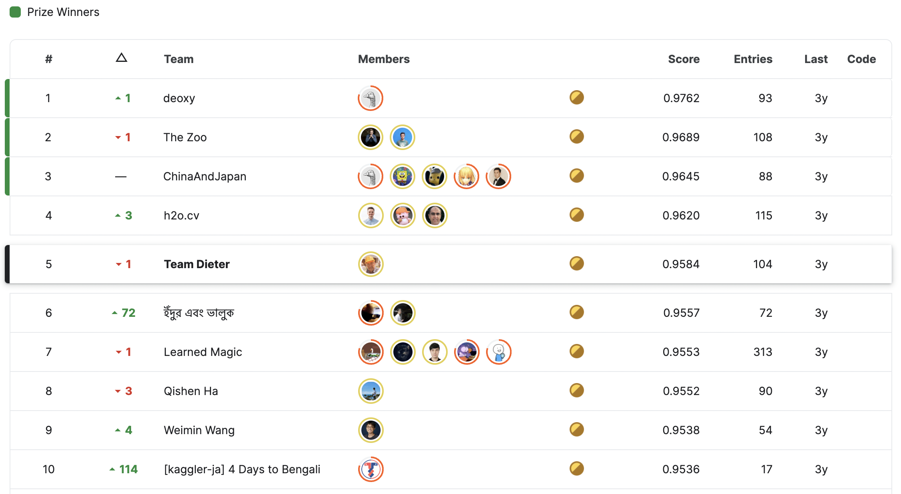

## Gathering experience inside and outside of kaggle

With the more robust yet flexible coding pipeline which I developed through the previous competitions, the pace at which I could iterate through ideas increased. The consequence was that I joined competitions at a later stage, but at the same time participated in more competitions within a year. With this strategy I further maximized learning experience continuing doing as diverse competitions as possible reaching from different complex NLP problems over bank transaction prediction to predicting molecular properties. 

Having a long term oriented mindset I focused on building reusable baselines and with growing expertise more and more parts of the work became standardized and I had more time to spend on trying extravagant ideas and reading research papers.

I was lucky to achieve a few more gold medals this way, and started to create a strong reputation shining with outside the box solutions. 

Probably this reputation helped to join forces with two guys shocking the Kaggle community with top placements in competition after competition - The Zoo, consisting of [Philipp](https://www.kaggle.com/philippsinger) and [Dimitry](https://www.kaggle.com/dott1718). We teamed for the [IEEE-CIS Fraud Detection challenge](https://www.kaggle.com/competitions/ieee-fraud-detection), where the task was to detect fraudulent customer transactions. Although the competition itself was not too exciting, working within a highly dedicated and communicative team was a real pleasure, setting the foundation for future collaborations. In the end, our team finished 6th out of over six thousand teams, which was the sixth gold medal within a year, a quantity that was unimaginable for me when starting my kaggle journey. 

At that time, I would have considered myself decently skilled in deep learning but not as one of the best within the Kaggle community. However, compared to people I had contact with in my daily job with a data science team at an insurance company, I was on a different planet. With local clients neither appreciating nor believing in the capabilities of deep learning I was frustrated with the lack of challenging problems, and consequently quit that job. Instead, together with two friends and kagglers I knew from my PhD time, I founded [khumbu.ai](https://www.khumbu.ai/company), a start-up providing state of the art deep learning based solutions. We were lucky to work with some local and international clients on interesting and challenging projects such as automated risk assessment, text-to-speech and document understanding.

Although running a start-up was more work, it yet enabled me to distribute my time more flexibly. Also the synergy between work projects and kaggle competitions improved significantly, enabling to apply knowledge gained at kaggle to client’s problems and vice versa. 

Given the amount of time I spent on solving deep learning problems (kaggle competitions & client projects) I gave the 2x GPU PC to my co-worker and upgraded to a new one containing 3x Geforce 1080 Ti, a better CPU and more RAM.

In this year, I also published a lot of educational kernels and discussions earning not only grandmaster status in these two tiers but also recognition in the community. 

## Becoming competitions grandmaster

I already had collected quite some gold medals, yet the last and most difficult requirement to become competition grandmaster was to be done: earning a solo gold medal, i.e. fighting alone against all other participants, where most of them are united in small teams, and finishing in a top position. 

Competing within a team has significant advantages. Obviously, you can split up tasks, iterate faster and explore more ideas given a fixed time. Moreover, you can discuss ideas and share knowledge. Even if you work independently and combine models just at the very end you would benefit from a significant blending effect. Working in a very active team is also quite motivating as you naturally do not want to disappoint your team members.

Now, while the motivation aspect should not be an issue when finally aiming for grandmaster status, the fact that you, as an individual, need to compete against teams is challenging. 

Additionally, depending on your personality, working weeks for a single goal creates a certain pressure. Even more since you compete in isolation for a goal which is of an all-or-nothing type. If you miss the gold medal by just a few places all was for nothing. (Of course it's not completely for nothing as you have learned a few things at least, but it still feels like it). Hence its important to choose a suited competition when going for grandmaster. It should not only be interesting enough to provide fun during weeks of working alone, but also be challenging enough to leave room for unique ideas, separating you from others.

As such, I chose the [Bengali.AI Handwritten Grapheme Classification challenge](https://www.kaggle.com/c/bengaliai-cv19) where competitors were asked to classify the components of handwritten Bengali. Thereby, three constituent elements have to be classified in each grapheme image: grapheme root, vowel diacritics, and consonant diacritics. I illustrate an exemplary grapheme which would be pronounced “pro” in english and consists of root "p", consonant diacritic "r" and vowel diacritic "o".

     

Besides addressing interesting data properties such as class imbalance and high intra-class variability, understanding Bengali writing, characterized by a lot of exceptions and special cases, gave significant advantage in this competition. So, I started with setting up a solid baseline mode. Interestingly you can either classify root, vowel and consonant diacritics separately or predict the grapheme as a whole and derive root, vowel and consonant from that. 

You can see an overview of the model architecture here:

The figure reads left to right. The input are original sized images at 137x236 resolution which are fed to a SeResNext50 which was pretrained on ImageNet. The features are then pooled and fed into a few fully connected layers before predicting root, vowel and consonant seperatly in the main head, and the grapheme as a whole in an auxiliary head. After tuning hyperparameters a bit, that model already put me at a good silver rank on the public leaderboard.

After that I dedicated a lot of time to research the rules and special cases of Bengali writing and gained a lot of domain knowledge. In parallel, I examined my models predictions to see which classes were explicitly bad, and found the key to perform well in this competition: 
A further representation of one of the vowel diacritics was not present in the training data, although being present in the test data. 

Interestingly, and typical for Kaggle, top solutions addressed this issue differently, each in their own creative way. While some used Bengali  ttf-fonts, the winning team used GANs to artificially generate images containing the missing representation. I used a completely different approach, as I learned through all my domain research that the missing representation is a mix of two available classes. I re-designed the training labels to a more granular level, which enabled the prediction of the missing mixed class. 

That trick helped me to push my leaderboard score significantly and I finished 5th place out of over 2000 teams at the end. 

Overall, I think the experience and knowledge gained in the previous year in a dozen competitions enabled me to be very efficient in terms of code and modeling. Hence, I could spend time on researching the domain of Bengali writing, which was one of the competition specific challenges. The won solo gold medal resulted in Kaggle competitions grandmaster status, a title currently only 240 people hold world wide and one of my biggest achievements so far.

